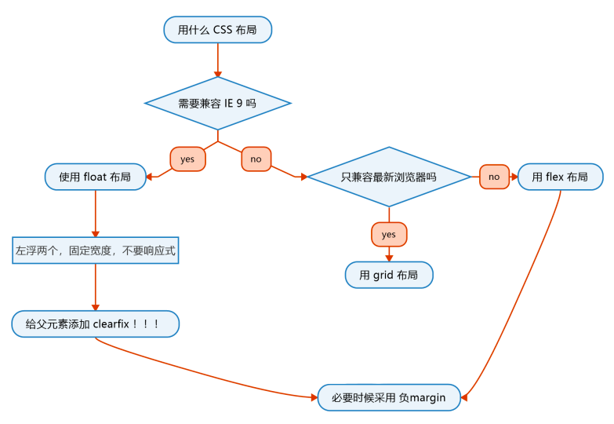
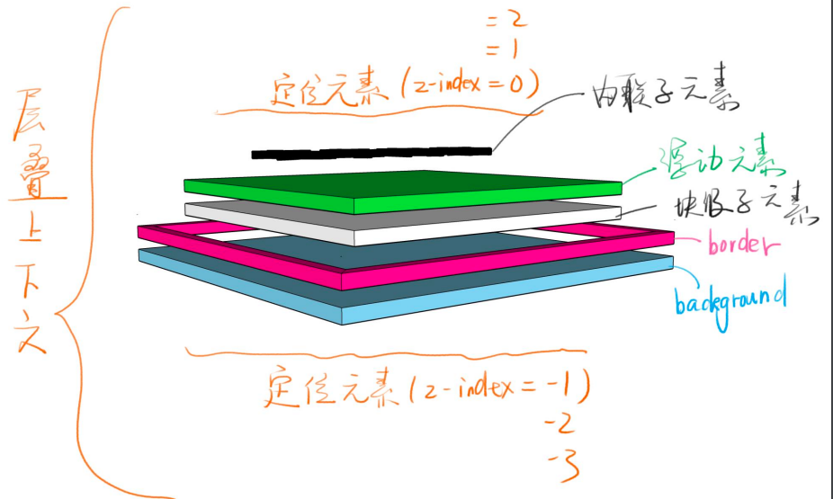
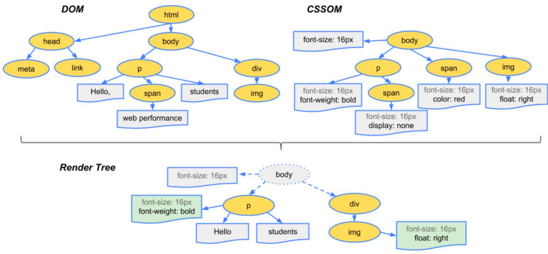
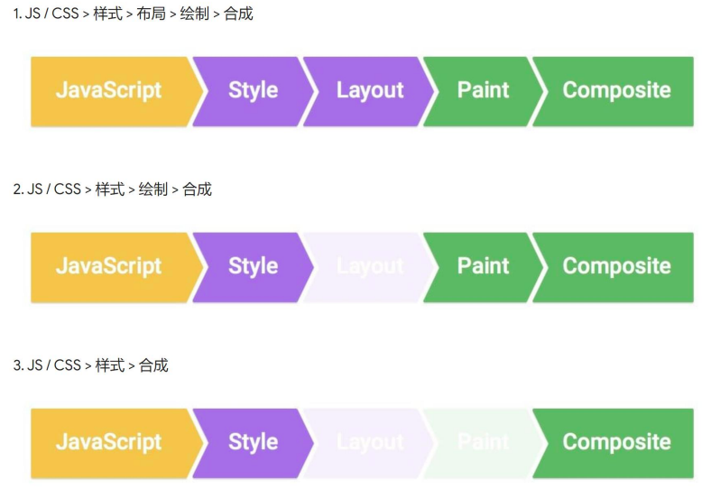

# CSS 基础

# 一、基本语法

CSS 的语法超级简单

- 语法一：样式语法

`选择器 { 属性名: 属性值; }`

- 语法二：`@` 语法

常用的 3 个：

`@charset “UTF-8”;`

`@import url(2.css);`

`@media (最小宽度) and (最大宽度) { 语法一 }`

# 二、选择器与优先级

## 1. 选择器

- id 选择器：#id
- class 选择器：.classname
- 属性选择器：a[href="aaa"]
- 标签选择器：div
- 伪类选择器：li:last-child
- 伪元素选择器：li:after
- 相邻兄弟选择器：h1 + p
- 子元素选择器：ui > li
- 后代选择器： li a
- 通配符选择器：*

## 2. 优先级

- `!important` 声明的样式优先级最高
- 內联样式：1000
- id 选择器：100
- 类选择器、伪类选择器、属性选择器：10
- 标签选择器、伪元素选择器：1
- * 选择器、子选择器、相邻兄弟选择器：0
- 继承样式优先级最低

计算的方式比较麻烦，记住：同级元素选择器越具体，优先级越高

# 三、文档流

文档流动方向：从左到右，从上到下

流动方向：

- `inline` 元素从左到右，到达最右边才会换行
- `block` 元素从上到下，每一个都另起一行
- `inline-block` 也是从左到右，但没有换行的现象

# 四、宽度

- `inline` 元素，宽度为内部 `inline` 元素的和，不能用 `width` 指定
- `block` 元素，默认自动计算宽度，可用 `width` 指定，不是**100%** ，而是能占多宽占多宽
- `inline-block` 元素，结合前两者特点，可用 `width`，默认是像 `inline` 元素的属性，但是设置宽度又可以跟 `block` 元素一样可以设置宽度

# 五、高度

- `inline` 元素，高度由 `line-height` 间接确定，跟 `height` 无关
- `block` 元素，高度由内部文档流元素决定，可以设 `height`
- `inline-block` 元素，跟 `block` 元素类似，可以设置 `height`

# 六、`display` 与元素类型

HTML5 所有元素都可以通过 display 设置为 `inline`、`block`、`inline-block`，没有内联元素、块级元素的划分，关键看样式

比如，给 `<span>` 加了一个边框，然后 `padding:10px 20px;`显示出是高度变高了，但是外面的 `<div>` 并没有被撑高呢?

因为 `padding` 撑高的只是可视范围，并没有撑高实际范围，`<span>`（`inline`元素）的实际高度就是行高，外面的 `<div>` 始终包住的就是实际高度，不过行高会继承

# 七、`overflow`

当内容大于容器，或者说内容的宽度或大于容器的宽度，会溢出

可以设置：`visible`、`hidden`、`scroll`、`auto`

如果有滚动条，`inline` 元素是默认只在第一屏显示

# 八、脱离文档流

如果 `<div>` 里面什么也没有那么 `<div>` 高度为 0

前面说过， `block` 元素高度由内部文档流元素决定，可以设 `height`

这句话的意思是不是说：有些元素可以不在文档流中？

哪些元素脱离文档流呢？

- `float` 元素
- 设置了 `position: absolute/fixed;` 的元素

怎么让元素不脱离文档流？

不要用上面属性不就不脱离了

# 九、盒模型

两种盒模型：

- 内容盒：内容就是盒子的边界，即宽高仅是内容宽高

`box-sizing: content-box;`

- 边框盒：边框才是盒子的边界，即宽高包含了内容、内边距、边框

`box-sizing: border-box;`

公式：

`content-box` 的 `width` = 内容宽度

`border-box` 的 `width` = 内容宽度 + `padding` + `border`

哪个好用？

`border-box` 好用，`width`设置，内容会相应的增大增小

同时指定 `padding`、`width`、`border` 就知道为什么了

如果没有指定 `padding`、`width`、`border`，那么这两个盒子就看不出区别了

# 十、`margin` 合并

只有上下，左右不会合并

## 1. 哪些情况会合并？

- 父子元素的 `margin` 合并
- 兄弟元素的 `margin` 合并

`margin-bottom`、`margin-top`

## 2. 为什么兄弟元素之间的 `margin` 会合并呢？

我们就是这样需要的，当你写 `margin: 30px 0;` 的时候，每个兄弟元素之间之后有一个 `margin`，这正是我们需要的，所以 CSS 就是这么设计的

## 3. 如何阻止合并？

父子合并用 `padding` 或 `border` 挡住

父子合并用 `overflow:hidden;` 挡住

父子合并用 `display:flex;`，不知道为什么

## 4. 总结：

兄弟合并是符合预期的，兄弟合并可以用 `inline-block` 消除

CSS 就是规定如果你写了 `inline-block`，那么他们的 `margin` 是不会跟别人合并的

# 十一、颜色

- 十六进制
    
    `#FF6600` 或 `#F60`
    
- rgba 颜色
    
    `rgba(0, 0, 0);` 或 `rgba(0,0,0,1);`
    
    `rgba(255,255,255, 0);` 是全透明，还有一个简写：`backgrouck-color: transparent;`
    
- hsl 颜色
    
    `hsl(360, 100%, 100%);`
    

# 十二、布局

## 1. 布局是什么？

把页面分成一块一块，按左中右、上中下排列

## 2. 布局分类

固定宽度布局：一般宽度为 960px、1000px、1024px

不固定宽度布局：主要靠文档流的原理来布局

响应式布局：PC 上固定宽度，手机上不固定宽度

## 3. 布局的 2 种思路

- 从大到小：先定下大局，然后完善每个部分的小布局
- 从小到大：先完成小布局，然后组合成大布局

## 4. 布局需要用到哪些属性？



# 十三、浮动

## 1. 步骤

子元素上加 `float: left/right;` 和 `width`

在父元素上加 `.clearfix`

```css
.clearfix:after {
	content: '';
	display: block;
	clear: both;
}
```

## 2. 注意事项

如果你在用 float 布局，你就不需要想着做响应式，因为手机上没有 IE，而这个布局时专门为 IE 准备的

IE6/7 存在双倍 `margin` bug，解决办法有两个：

- 将错就错，针对 IE6/7 把 `margin` 减半
- 再加一个 `display: inline-block;`

# 十四、定位

## 1. 布局与定位

布局是屏幕平面上的

定位是垂直于屏幕的

## 2. `position`

值：

- `static`（默认值）：待在文档流里面
- `relative`：相对定位，升起来但不脱离文档流
- `absolute`：绝对定位，定位基准是：祖先里的距离最近的第一个非 `static` 元素
- `fixed`：固定定位，定位基准是：视口 viewport
- `sticky`：粘滞定位，不好描述直接举例

注意事项：

- 如果使用 `absolute`，一般得给其父元素加一个 `relative`
- 如果使用 `absolute` 或 `fixed`，一定要设置 `top/left/right/bottom`

使用场景：

- `relative`：设置到 `absolute` 元素的父元素上
- `absolute`：脱离原来的位置，另起一层，比如对话框的关闭按钮、鼠标提示等
- `fixed`：烦人的广告、回到顶部按钮等；手机上尽量不要用这个属性，非常多的坑

## 3. 一个 `<div>` 的分层



浮动元素脱离文档流，其实就是浮起来一点点

## 4. 层叠上下文

### 4.1 比喻

- 每个层叠上下文就是一个新的小世界（作用域）
- 这个小世界里面的 `z-index` 跟外界无关
- 处于同一个小世界的 `z-index` 才能比较
- 如果父级元素写了一个 `z-index: 0;` 那么它就是一个层叠上下文小世界，如果没写，默认层叠上下文就是 `<html>`
- 记住`负 z-index` 逃不出小世界

### 4.2 创建层叠上下文

- 最简单的就是写了 `z-index: 0;`（前提是它拥有绝对、相对定位属性，`fixed` 定位不需要设置 `z-index` 都有层叠上下文）
- 但是 `z-index: auto;` 是不创建的，除了这个可以创建还有哪些也能创建呢？有 `z-index` / `flex` / `opacity` / `transform`

# 十五、动画

## 1. 定义

由许多静止的画面（帧），以一定的速度（如每秒30张）连续播放时，肉眼因视觉残像产生错觉而误以为是活动的画面

## 2. 帧

每个静止的画面都叫做帧

播放速度：每秒 24 帧（影视）或者每秒 30 帧（游戏）

## 3. 一个简单的例子

将 `<div>` 从左向右移动

```jsx
let n = 1
let id = setInterval(() => {
  if(n <= 200) {
      demo.style.left = n + 'px'
      n = n + 1
  }else {
      clearInterval(id)
  }
}, 1000/60)
```

## 4. 浏览器的渲染原理

### 4.1 步骤

根据 HTML 构建 HTML 树（DOM） 

根据 CSS 构建 CSS 树 （CSSOM） 

将两棵树合成一颗渲染树（render tree） 

Layout 布局（文档流、盒模型、计算大小和位置）

Paint 绘制（把边框颜色、文字颜色、阴影等画出来）

Composite 合成（根据层叠关系展示画面）

### 4.2 三棵树



### 4.3 三种更新方式



- 第一种，全走：

`div.remove()` 会触发当前消失，其他元素 relayout 

- 第二种，跳过 layout

改变背景颜色，直接 repaint + composite 

- 第三种，跳过 layout 和 paint

改变 `transform`，只需 composite，改变必须全屏查看效果，在 `<iframe>` 里看有问题

## 5. `transform`（变形）

### 5.1 四个常用功能

- 位移 `translate`
- 缩放 `scale`
- 旋转 `rotate`
- 倾斜 `skew`

一般都需要配合 `transition` 过渡 

`inline` 元素不支持 `transform`，需要先变成 `block`

### 5.2 写法

```css
translateX(<length-percentage>)
translateY(<length-percentage>)
translate(<length-percentage>, <length-percentage>?)
translateZ(length)且父容器 perspective
translate3d(x, y, z)
translate(-50%, -50%) 可做绝对定位的居中
```

### 5.3 `scale`

```css
scaleX(<number>)
scaleY(<number>)
scale(<number>, <number>?)
```

`number` 是之前的多少倍

要动画效果的话需要在元素自身加上 `transition`

### 5.4 `rotate`

```css
rotate([<angle> | <zero>])
rotateZ([<angle> | <zero>])
rotateX([<angle> | <zero>])
rotateY([<angle> | <zero>])
```

一般用于 360 度旋转制作 loading

### 5.5 `skew`

```css
skewX([<angle> | <zero>])
skewY([<angle> | <zero>])
skew([<angle> | <zero>], [<angle> | <zero>]?)
```

日常使用较少

### 5.6 `transform` 多重效果

```css
transform: scale(0.5) translate(-100%, -100%);
transform: none; /*取消所有*/
```

## 6. `transition`（过渡）

### 6.1 作用

补充关键帧

### 6.2 语法

`transition`: 属性名 时长 过渡方式 延迟;

```css
transitio: left 200ms linear;
```

可以用逗号分隔两个不同的属性 

```css
transition: left 200ms, top 400ms;
```

可以用 `all` 代表所有属性

```css
transition: all 200ms;
```

过渡方式：`linear` 匀速 | `ease` 先快后慢 | `ease-in` | `ease-out` | `ease-in-out` | `cubic-bezier` | `step-start` | `step-end` | `steps`

### 6.3 注意事项

### a. 并不是所有属性都能过渡

`display`: `block` => `none` 没法过渡，怎么可能让一个东西看见到看不见过渡呢？

一般改成 `visibility`: `hidden` => `visible` 

只要有过渡规律就可以

### b. 过渡的中间点

过渡必须要有起始，一般只有一次动画，或者两次

比如 `hover` 和非 `hover` 状态的过渡

如果除了起始，还有中间点怎么办？

- 使用两次 `transform`

`.a` === `transform` ===> `.b` 

`.b` === `transform` ===> `.c` 

如何知道到了中间点呢？ 

用 `setTimeout` 或者监听 `transitionend` 事件 

- 使用 `animation`

声明关键帧，然后在关键帧上写动画效果，将其挂到元素动画启动元素里面的 `animation` 后面

### c. `@keyframes` 完整语法

- `from...to...`

```css
@keyframes slidein {
	from {
		transform: translateX(0%);
	}
	to {
		transform: translateX(100%);
	}
}
```

- 百分数

```css
@keyframes identifier {
	0% { top: 0; left: 0; }
	30% { top: 50px; }
	68%, 72% { left: 50px; }
	100% { top: 100px; left: 100%; }
}
```

## 7. `animation`（动画）

`animation`: 时长 | 过渡方式 | 延迟 | 次数 | 方向 | 填充模式 | 是否暂停 | 动画名; 

时长：1s 或者 1000ms 

过渡方式：跟 `transition` 取值一样，如 `linear` 

次数：3 或者 2.4 或者 `infinite` 

方向：`reverse`反向 | `alternate`正反交替 | `alternate-reverse` 

填充模式：`none` | `forwards` | `backwards` | `both` 

是否暂停： `paused` | `running` 

以上所有属性都有对应的单独属性